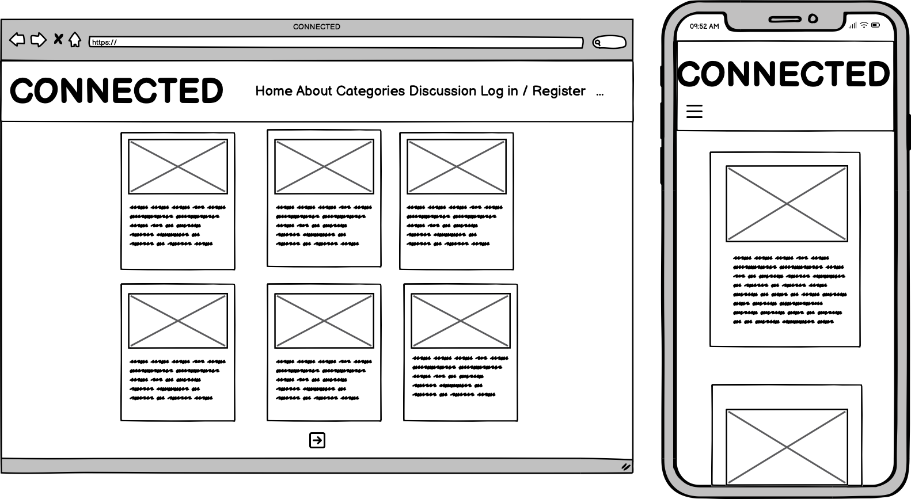
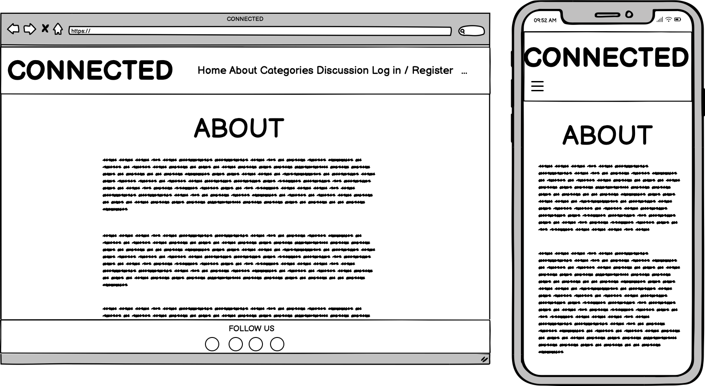
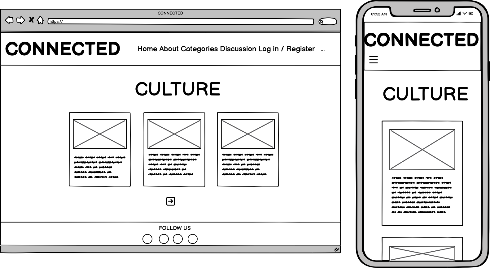
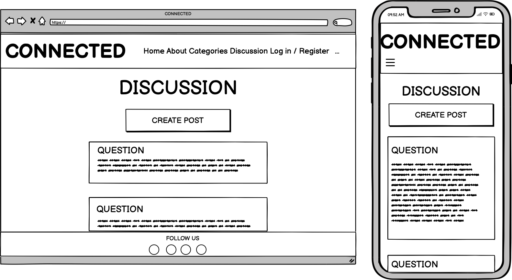
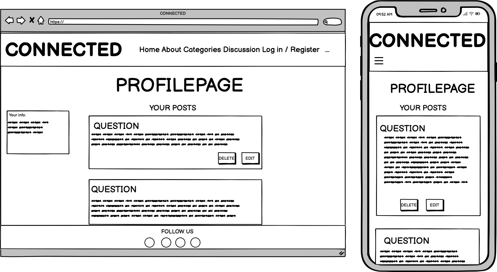
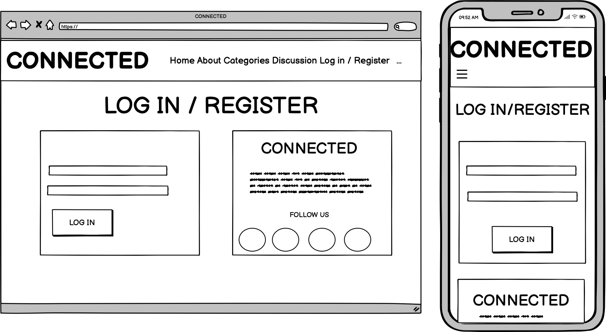

# CONNECTED 

Connected is a newssite focused on articles regarding technology and internet media.
The sites maingoal is the update the user about different discoveries in subjects and categories such as:
- Artificial Intelligence
- Technological Sience
- Online Culture
- Technews
- Technological Gadgets

Connected is not only a site for news and article research, but also an online forum where the user can discuss with other users about different subjects and questions, regarding the main concept. 

This website includes a firstpage displaying the latest articles, an "About us" page, different pages for the different categories that the article is posted in, an discussion forum, and lastely their own profilepage which allow the user to see their own previously made posts and comments. 

The Connected website can be found here - [Connected.](https://connected-c643fb1afe74.herokuapp.com/).

## Table of Contents

SKRIV INNEHÅLLSFÖRTECKNING HÄR

## Site Owner Goals

- As a Site Owner I can present relevant and interesting news articles about recent discoveries or updates in the online tech world. 

- As a Site Owner I can allow the users access to the website and dicsussionforum, allowing the user to comment on different articles and discussionpost along with other users and because of that create an interactiv enviorment for who wishes to join.

- As a Site Owner I can present the user with a website that is easy to navigate, fully responsive and that contains a simple, yet beautiful layout, suitable for the websites purpose.

- As a Site Owner I can allow the user to sign up to the website and interact thorugh comments and posts. 

## User Stories

#### User Profile

- As a Site User I can register my account, allowing me to comment on existing articles and discussion posts. 

- As a Site User I can register my account, allowing me to create my own posts in the designated discussion forum. 

- As a Site User I can find all my previously made posts and comments in my own profile.

- As a Site User I can edit and delete my previously made comments and posts, even if they been approved or haven't been approved, by the site administration. 

- As a Site User I can log in or log out of my account so that I can keep my account secure.

- As a Site User I can see if I am logged in or not.

#### User Navigation

- As a Site User I can easily navigate to the home page, viewing the latest articles posted.

- As a Site User I can easily navigate to a page regarding a specific category containing the relevant articles.

- As a Site User I can easily find information about the website and the websites purpose.

- As a Site User I can navigate to the online forum allowing me to interact with other users on relevant topics. 

- As a Site User I can easily sign up, log in and log out.

#### Site Administration

- As a Site Administrator I can easily update the website with new articles and associated images.

- As a Site Administrator I can manually approve the users comments before the site users can view them, in order to secure that all the content is relevant and following the websites guidelines.

- As a Site Administrator I can manually approve the users posts before the site users can view them, in order to secure that all the content is relevant and following the websites guidelines.

#### User Stories that hasn't been implemented

- As a Site User I can choose what category I want my discussion post to be in. 

- As a Site User I can filter the articles by date or writer.

#### Future User Stories to consider

- As a Site User I can save or give a like to articles. 
- As a Site User I can find my saved or liked articles in my own profilepage to find the concerned articles easier.

## Design & Layout 

The site has a very simple and clean design which was chosen purposely in order to create a sense of reliability that aligns with the websites goals, to act like a newssite.

### Wireframes

Wireframes were produced using Balsamiq.

 

 
Home Page

 

 

    
About Us Page

 

  

    
Category Page

 

 

    
Discussion Page

 

  

    
Profile Page

 

  

    
Log in / Register Page

 

### Color Scheme 

The colors used for Connected Website is mainly black, white and grey, to present a serious approach. 
The different pop of colors that appear are mainly focused on the buttons and icons in the footer. 
The colors or the button is matched and faded with different generic gradient palettes based of these:

### Images

All images is uploaded in the adminpanel to the website with cloudinary. 
Every image is borrowed from:
[Pexels](https://www.pexels.com/sv-se/).

### Fonts

The Roboto font is used on the main content on the website, for example the "About us" page. 
On every heading the font Oswald is used, as well in the logo name in the header. 

All fonts are from [Google Fonts](https://fonts.google.com/).

### Favicon 

The favicon was generated through [Favicon.io](https://favicon.io/), and is depicting a big C for Connected.

### Social Media Icons

The design and layout effects of the social media icons in the footer is borrowed from [parthwebdev - GitHub](https://github.com/parthwebdev/UI-Components/blob/main/Socials/02/index.html), and are responsible for creating the effect when the icon is held, the background color of the selected social media icon is transferred to the same apps color scheme.

## Agile Methodology

To manage the development of this project, I used the GitHub projects for an agile approach. 
You can view the projectboard
[here.](https://github.com/users/tildeholmqvist/projects/9)

When planning for this project 11 Github Issues were created, with two out of this as future improvement.
Each issue has a list of acceptance criterias, making the execution of the task clear, and easier to navigate to completion.

## Data Model

This project uses the principles of Object-Oritented Programming(OOP) along with Django's Class-Based Generic Views, to create this online news platform.

The site administator can post articles, while the site users are allowed to comment on them. 
The site user can however post their own post in the dedicated online forum.

For user authentication, Django Allauth is employed to ensure a secure access. 

To manage the posts, both in articles and in the discussion forum, a post model was developed, 
showcasing the title, author and date. 

To manage the categories, a category model was developed, showcasing the title of the category, allowing the user to easily navigate to their pick of category. 

To manage comments, both in articles and in the discussion forum, a comment model was developed, working in the same way as the post model, with some additions. 

## Features

### Header

#### Logo
- A logo was created using the Oswald font.

- The logo is linked to the home page for easier navigation for the user.

#### Navigation Bar

- The header and navigation bar is present at every page and includes every link to the other pages.

- The Category link contains a dropdown menu allowing the user to pick their category of choice. 

- For the logged in user the My profile link contains of a dropdown menu allowing the user to pick between showing their profilepage or log out. 

- For the signed out user the navigation bar contains a link to Log in / Register 

### Footer

- The footer section includes links to Instagram, Facebook, Youtube and Linkedin.

- When the links in the footer is clicked, that opens a separate browser tab to avoid pulling the user away from the site.

- When hovering the icons their apps original colorscheme will appear.

### Home Page

- The homepage consists of the latest news articles, showing six posts per page. 

- The homepage articles consists of a preview of the post, showing images and excerpts of the article.

- The homepage has a page navigator allowing the user to read more than six articles. 

### The Article Page

- The article page appears if a user clicks on one of the titles on the articles on the home page.

- The article page consists of the different articles, depending on what articles title the user clicked on. 

- The article page allows a logged in user to comment on the article.

- The article page allows a logged in user to see their own, unapproved comments. 

- The article page allows a signed out user to read the articles, but not to comment on them. 

### About Us Page 

- The about us page lets the user read about the company thats behind the news site Connected. 

- The about us page informs the user about what they can expect from the newssite and what the newssites goals is. 

### The Discussion Page

- The discussion page consists of discussion posts made my different users regarding the topic of the newssite. 

- The discussion page is displaying a login button, if the user is not logged in, transfering the user to a login form. 

- The discussion page is displaying a button with the caption "Create Your Own" allowing the user to create their own post in the discussion forum. 

### The Discussionpost Page

- The discussionpost page appears if a user clicks on one of the titles on the discussions in the forum.

- The discussionpost page consists of the different discussionposts, depending on what discussion title the user clicked on. 

- The discussionpost page allows a logged in user to comment on the discussions.

- The discussionpost page allows a logged in user to see their own, unapproved comments. 

- The discussionpost page allows a signed out user to read the discussions, but not to comment on them. 

### The Profile Page

- The profile page is a page just available for the signed in user. 

- The profile page includes a User information box, displaying the Username and email adress. 

- The profile page consists of the logged in users previously made comments on news articles and discussionposts, as well as their own discussion posts.

### User Account Pages

#### Log in / Register 

- The Log in / Register page consists of a Log in form, provided by Django Allauth. 

- The Log in / Register page contains a button allowing the user to create a new account if they don't already have one. 

- The Log in / Register page contains a textbox with a short description about the page and the page social media links, as icons. 

#### Sign Up 

- The Sign Up page consists of a sign up form, provided by Django Allauth.

- The Sign Up page lets the user enter a valid username, emailadress and password, before allowing them to sign up for Connected.

## Testing

#### User Story Testing 

 - All user stories have been tested out, and is working correctly. 
 - All site owner stories have been testes out, and is working correctly.

## Validator Testing 

### W3C Validator HTML
- When validating the About Page, no errors where found. 
- When validating the Log in / Sign up page, no errors where found. 
- When validating the Log out page, no errors where found.
- When validating, errors related to the summernote text editor occured on these pages: 
  - Home Page
  - Article Page
  - Categories Page
  - Discussion Page
  - Profilepage 

[W3C Validator](https://validator.w3.org/)

#### Summernote Errors
When validating the website a lot of errors occured, all due to the textareas created in the summernote text editor. 

#### Summernote Text Editor and Troubleshooting
Summernote is a WYSIWYG editor, used for creating text areas in web aplications. While Summernote simplifies the experience for the users and enables interactiv content creation on the website, including features allowing the users and admins to write textareas, include images and font styling, this can sometime result in an unexpected behaving code, that doesn't pass through the HTML validators. 

When troubleshooting these errors, it's a good idea to isolate the code snippets that are created with Summernote, to identify that the errors is connected to the Summernote text areas. This makes it easier to guarantee that the issues or errors only referred to the summernote editor. 

The summernote errors could possibly have an impact on how the website presents in other tests and contexts,
the main code structure appears to be fine and without any errors or bugs. 
However it is important to address the fact that the Summernote is causing errors in the code, to ensure the overall quality of the website. 

### W3C Validator CSS
#### When validating the CSS styling, 2 errors where found:
- Both errors were located in the code handling the icons in the footer. This code used for the icons layout is borrowed from[parthwebdev - GitHub](https://github.com/parthwebdev/UI-Components/blob/main/Socials/02/index.html).
- When troubleshooting these errors, other attributes where tried out without achieving the same effect. 
- Beacuse of this, I decided to keep the CSS code intact and address the errors without changing it.

[W3C Validator CSS](https://jigsaw.w3.org/css-validator/)

### JS Hint 

No errors where found in my JavaScript.

- The following metrics were returned:
  - There are 7 functions in this file.
  - Function with the largest signature take 1 arguments, while the median is 1.
  - Largets function has 29 statements in it, while the median is 4.
  - The most complex function has a cyclomatic complexity value of 7 while the median is 1.

[Jshint validator](https://jshint.com/)

### PEP8

No errors where found in my Python files.

[CI Python Linter](https://pep8ci.herokuapp.com/)

## Lighthouse 
| Page           | Performance  | Accessibility | Best Practices  | SEO |
|----------------|:------------:|:-------------:|:---------------:|:---:|
|                |              |               |                 |     |
| DESKTOP        |              |               |                 |     |
| Home           |           81 |            90 |              86 | 100 |
| Article Page   |           90 |            86 |              91 | 100 |
| About Us       |           99 |            97 |              95 | 100 |
| Categories     |           78 |            86 |              86 | 100 |
| Discussion     |           99 |            94 |              95 | 100 |
| Log in/Register|           99 |            88 |              95 | 100 |
| Log out        |           98 |           100 |              95 | 100 |
| Create Discussion   |           95 |           89 |             95 | 100 |
| Profilepage    |           97 |            95 |              91 | 100 |
| Edit Comment   |          100  |           94 |              95 |  100 |
| Edit Post      |           97 |            89 |              95 | 100 |
|                |              |               |                 |     |
| MOBILE         |              |               |                 |     |
| Home           |           71 |            90 |              86 | 100 |
| Article Page   |           71 |            90 |              91 | 100 |
| About Us       |           99 |            97 |              95 | 100 |
| Categories     |           72 |            86 |              86 | 100 |
| Discussion     |           93 |            94 |              95 | 100 |
| Log in/Register|          78  |            88 |              95 | 100 |
| Log out        |           87 |           100 |              95 | 100 |
| Create Discussion   |           90 |           89 |             95 | 100 |
| Profilepage    |           91 |            91 |              95 | 100 |
| Edit Comment   |           94  |           94 |              95 | 100 |
| Edit Post      |           90 |            89 |              95 | 100 |

## Browser Testing

The website has been tested on different browsers such as Google Chrome, Safari and Firefox, and is working correctly.

## Device Testing

The webpage has been tested on different devices such as Iphone, Ipad, MacBook Pro and iMac, and is working correctly.

## Responsiveness

The websites responsiveness has been tested through the Google Chrom Dev Tool, [Am I Responsive?](https://ui.dev/amiresponsive) and [Responsinator](http://www.responsinator.com/) and is working correctly.

## Manually Testing 
- Buttons:
  - All buttons on the website has been tested and is working correctly. 
- Messages:
  - Messages providing feedback to the users actions is working correctly. 
- Sign Up Form: 
  - The Signup form is working correctly, demanding valid input.
- Log In Form: 
  - The Login form is working correctly, demanding valid input.
- Create Discussion Form: 
  - The Create Discussionform is working correctly, demanding valid input in the title. 
  - The Create Discussioform is however also working even with unvalid input in the textarea.
- Comments:
  - The leavingcomments form are working correctly on all pages. 
- Edit Comment or Discussion: 
  - The Edit tool is working correctly on all pages.
- Delete Comment or Discussion: 
   - The Delete tool is working correctly on all pages. 

## Bugs and Issues

Overall the website is working correctly, and the main code is free from errors, except for the [Summernote related ones](#summernote-errors).

I encountered a bug when using the discussion ID as a button attribute. However, removing this attribute caused the button to malfunction, so I left it unchanged.

### Unfixed Bugs

When a user is creating their own discussion post, they are able to submit the post with invalid input in the textarea.

Although users are required to insert a valid title, the discussion will still be posted even if the textarea contains invalid content.

For the time being, I have chosen to leave this bug unresolved. Since site administration approval is required before discussion posts are displayed to all users, an empty or invalid discussion post does not significantly impact the user experience.

When users click on 'Forgot your password?', they're unable to reset their password. Although this is a significant issue, it's not directly related to this project, as it's a mockup site. Therefore, I've chosen not to address this problem.

However, addressing these issue is a potential future improvement that I will consider implementing.

## Deployment - Heroku

The website was deployed through the hosting platform Heroku, from it's GitHub repository.

### Create the Heroku App:
- Create an account or log in to [Heroku](https://dashboard.heroku.com/apps).
- On the main page click "New" at the top right corner and choose "Create New App" from the dropdown menu.
- Give the app a unique and meaningful name.
- Next up, select your region.
- Click "Create App".

### Connect the Postgres database:
- In the Resources tab, type "Postgres", and select "Heroku Postgres".
- Copy the DATABASE_URL from Config Vars in the Settings Tab.

### Create the enviorment setup:
- Create an env.py file in the main directory of your GitPod workspace.
- Add the DATABASE_URL value and your personally choosed SECRET_KEY value to the env.py file.
- Update your settings.py file to import the env.py file and add the paths for both the DATABASE_URL and SECRET_KEY.
- Comment out the default database configuration.
- Save your files and make the migrations.
- Add Cloudinary URL to the env.py file.
- Add Cloudinary to the "installed apps" in the settings.py.
- Configure static files settings including URL, storage path, directory path, root path, media URL, and default file storage path.
- Connect the file to the templates directory in Heroku.
- Rename the templates directory to TEMPLATES_DIR.
- Add Heroku to your ALLOWED_HOSTS.

### Create  Files/Directories
- Create the requirements.txt file
- Create a file named "Procfile" in the main directory of your project.
- In "Procfile" add "web: gunicorn project-name.wsgi".

### Update the Heroku Config Vars
- In Heroku, add these Config Vars:
    - SECRET_KEY value 
    - CLOUDINARY_URL
    - PORT = 8000
    - DISABLE_COLLECTSTATIC = 1

### Deploy your site
- Before deploying, make sure that your DEBUG is set to false in your settings.py file.
- Go to the deploy tab on Heroku and navigate to connect to GitHub, and then pick the required repository.
- Scroll to the bottom of the page where you can choose if you want to Enable Automatic Deploys for 

- Go to the deploy tab on Heroku and connect to GitHub, then to the required repository. 
- Scroll down to the bottom of the page and there you can choose if you want the deploys to be Automatic or Manually. The Manually deployed branches needs redepolying each time the repository is updated.
- Deploy your website. 
- Click "View", or scroll up to "Open App" to visit the deployed site.

The deployed website can be found here - [Connected](https://connected-c643fb1afe74.herokuapp.com/).

## Languages

- Python
- HTML
- CSS
- Javascript

## Frameworks, Libraries and Programs Used

- [Django](https://www.djangoproject.com/): The main framework used in this project, built with Python.
- [Django-allauth](https://django-allauth.readthedocs.io/en/latest/installation.html): The authentication library used for creating user accounts in this project.
- [PostgreSQL](https://www.postgresql.org/): Used as the database for this project.
- [GitHub](https://github.com/): Used as an agile tool and for project management.
- [Heroku](https://dashboard.heroku.com/login): Used as the cloud-based platform to deploy the site.
- [Bootstrap](https://getbootstrap.com/): Used as the main front-end framework.
- [Summernote](https://summernote.org/): A WYSIWYG editor.
- [Cloudinary](https://cloudinary.com/): Used for for image hosting services on the site.
- [Font Awesome](https://fontawesome.com/): Used for icons in the footer, and on comments.
- [Google Fonts](https://fonts.google.com/): Used to import fonts, elevating the layout of the project.
- [Coolors](https://coolors.co/): Used to find the right colors and palettes.
- [Balsamic](https://balsamiq.com/wireframes/desktop/#): Used to create the wireframes.
- [Am I Responsive?](https://ui.dev/amiresponsive): Used for the images for the README, showing the responsiveness of the site.
- [Favicon](https://favicon.io/): Used to create the favicon.
- [W3C](https://www.w3.org/): Used for HTML & CSS Validation.
- [PEP8 Online](http://pep8online.com/): Used to validate all the Pythoncode files.
- [Jshint](https://jshint.com/): Used to validate all javascript.

**Additional Libraries Used**:
- [asgiref](https://pypi.org/project/asgiref/): ASGI specification reference implementation.
- [oauthlib](https://pypi.org/project/oauthlib/): Provides OAuth client/server functionality.
- [psycopg2](https://pypi.org/project/psycopg2/): Python adapter for PostgreSQL database.
- [PyJWT](https://pypi.org/project/PyJWT/): Library for JSON Web Token encoding and decoding.
- [python3-openid](https://pypi.org/project/python3-openid/): Python OpenID library.
- [requests-oauthlib](https://pypi.org/project/requests-oauthlib/): Provides OAuth support for requests.
- [sqlparse](https://pypi.org/project/sqlparse/): SQL parser for Python.
- [urllib3](https://pypi.org/project/urllib3/): HTTP client library for Python.
- [whitenoise](https://pypi.org/project/whitenoise/): Serves static files in Django applications.

## Credits 
- [Stack Overflow](https://stackoverflow.com/)
- [Bootstrap 4.0 Docs](https://getbootstrap.com/docs/4.0/getting-started/introduction/)
- [Django Docs](https://docs.djangoproject.com/en/5.0/)
- [Real Python](https://realpython.com/)
- [MDBootstrap](https://mdbootstrap.com/docs/standard/extended/login/)
- [Medium](https://medium.com/)
- [Learn Django](https://learndjango.com/tutorials/django-slug-tutorial)
- [Dev Handbook](https://www.devhandbook.com/django/user-profile/)
- [Dev, Profile](https://dev.to/earthcomfy/django-user-profile-3hik)
- [Code Institute - Blog Walkthrough Project](https://github.com/Code-Institute-Solutions/Django3blog)
- [Pexels](https://www.pexels.com/sv-se/): Used for the images on the site.
- Every article and comment is a mock article, created with [Open AI](https://chat.openai.com/).
- Tutor Support, Code Institute, for their support and advice.
- My mentor Antonio, for all of his knowledge, support and advice.
